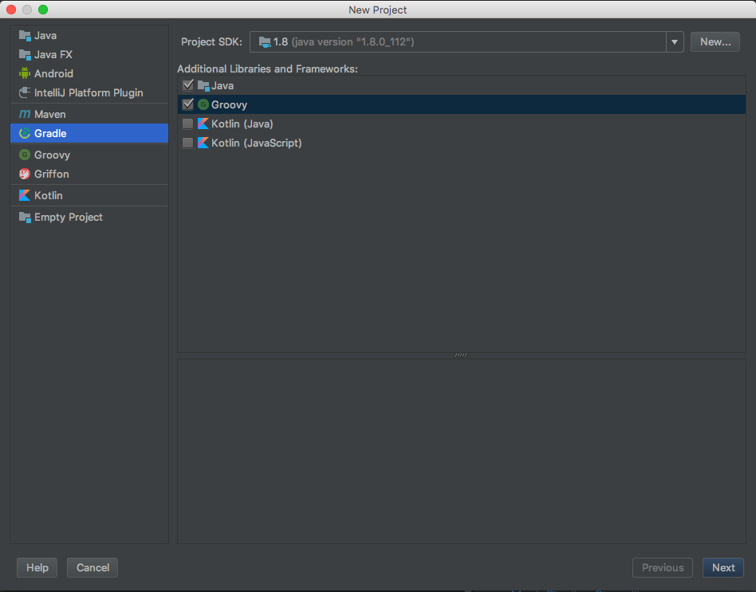
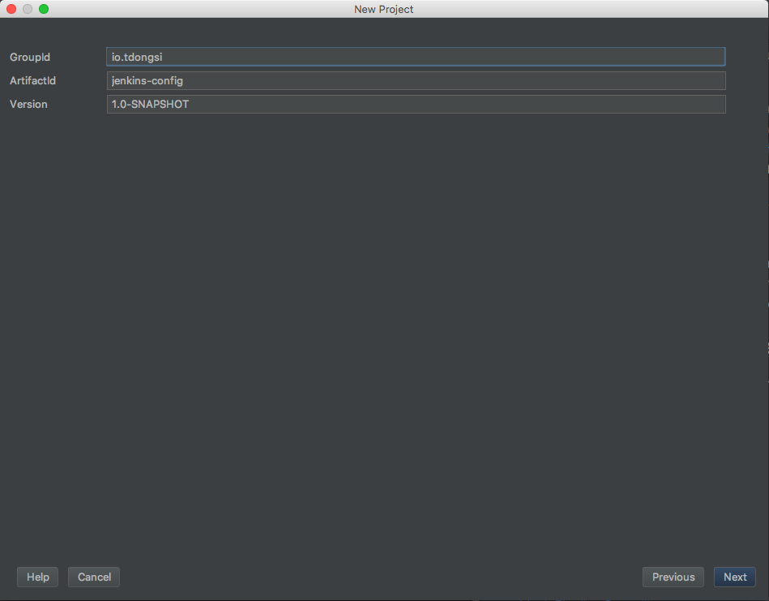
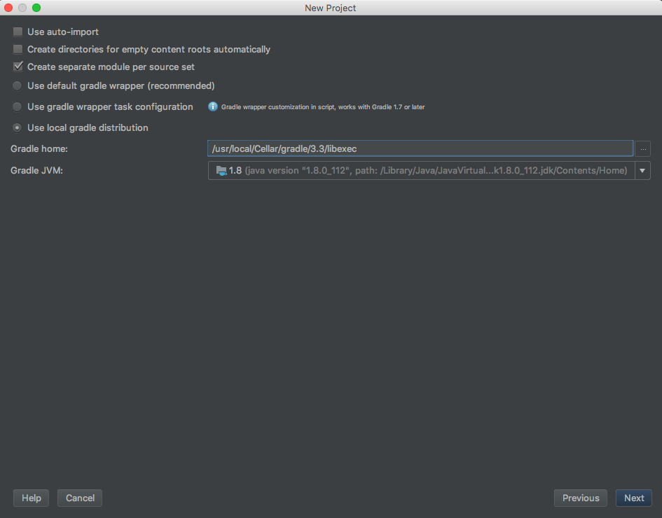
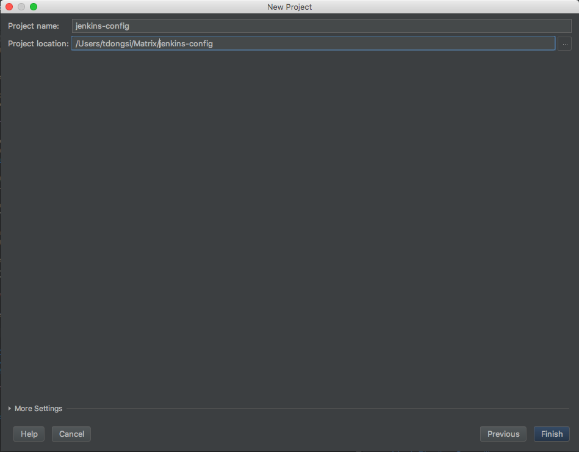
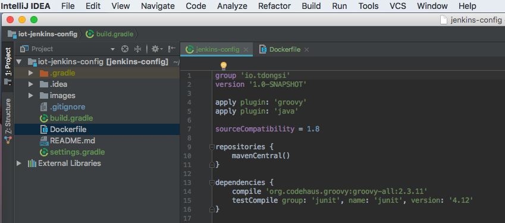

# Setup IntelliJ IDEA for Jenkins

## Start a new project

It is best to start anew:

1. Select **File | New Project**
1. Select **Gradle**
1. Select **Java** AND **Groovy**

1. Choose **GroupId** and **ArtifactId**

1. Enter path to Gradle. For Gradle on Mac installed via Homebrew, the Gradle home is like this:

1. Choose **Project name** and **Project Location**

1. Finish

## Configure IDEA

