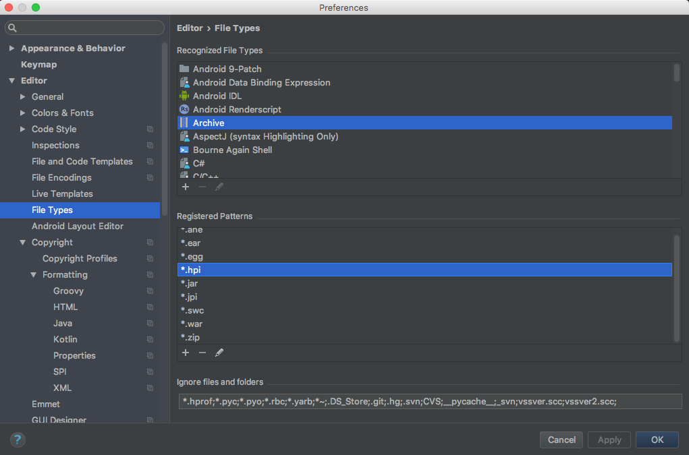

# Setup IntelliJ IDEA for Jenkins

## Start a new project

It is best to start anew:

1. Select **File | New Project**
1. Select **Gradle**
1. Select **Java** AND **Groovy**

1. Choose **GroupId** and **ArtifactId**

1. Enter path to Gradle. For Gradle on Mac installed via Homebrew, the Gradle home is like this:

1. Choose **Project name** and **Project Location**

1. Finish


## Configure IDEA

Set up for Jenkins Plugins files which are of types **.hpi** or **.jpi**.

1. Select **IntelliJ IDEA | Preferences | Editor | File Types**
1. Select **Archive**
1. Select **+** at the bottom left corner
1. Add both **.hpi** and **.jpi**
1. Select **OK**



Modify **build.gradle** to add the following lines.

```groovy
    compile 'org.jenkins-ci.main:jenkins-core:2.23'

    // Jenkins plugins
    compile group: 'org.jenkins-ci.plugins', name: 'credentials', version: '2.1.13', ext: 'jar'
    compile group: 'org.jenkins-ci.plugins', name: 'matrix-auth', version: '1.6', ext: 'jar'
    compile group: 'org.jenkins-ci.plugins.workflow', name: 'workflow-cps', version: '2.39', ext: 'jar'

    // TRICKY: The lib folder contains all other plugins *JAR* files
    // if not found in Maven
    compile fileTree(dir: 'lib', include: ['*.jar'])
```

The above example will grab Jenkins core libraries, Matrix Authorization Plugin hpi, other plugin dependencies and javadocs for all imported libraries.
Having these libraries imported will enable code auto-completion, syntax checks, easy refactoring when working with Groovy scripts for Jenkins.
It will be a great productivity boost.

NOTE 1: The last line `compile fileTree` is the last resort for any Jenkins plugins that you cannot find the right group ID and artifact ID.
It is rare these days but such cases cannot be completely ruled out.

NOTE 2: The `ext: 'jar'` is VERY important to ensure that `jar` files, instead of `hpi`/`jpi` files, are being downloaded and understood by IntellJ.
Without that `ext` option specified, IntellJ won't find JAR files nested in `hpi`/`jpi` files which is the default binaries for Jenkins plugins.

The final **build.gradle** will look like [this](https://github.com/tdongsi/jenkins-steps-override/blob/master/build.gradle).

