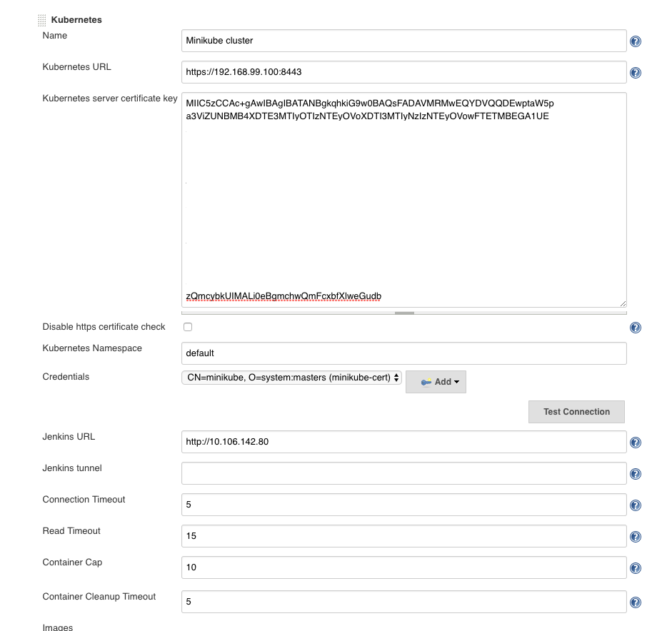
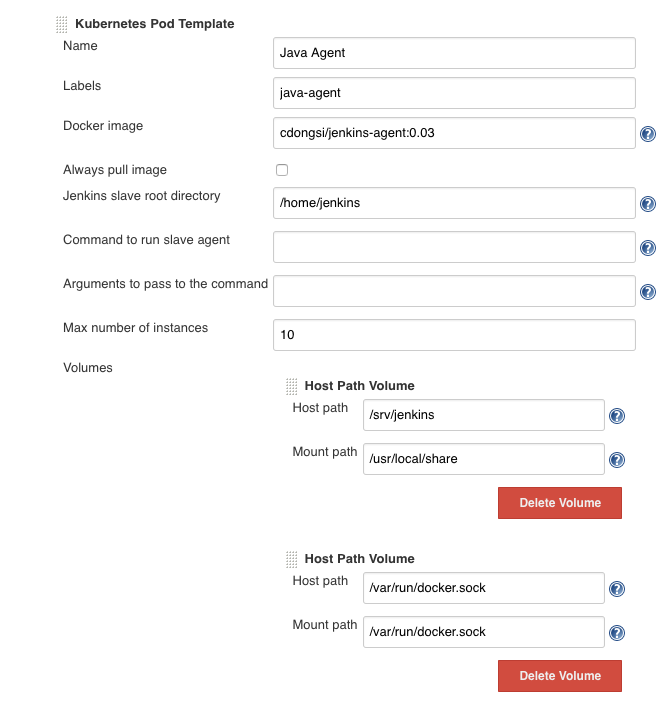

# Quick-start guide

Jenkins config as code for local development of Groovy-based Pipeline libraries.

## Steps to get started quickly

The following steps assume other one-time setups are already done.

* Install minikube.

### Build the Docker images

Build the Docker images for Jenkins master and agents:

```text
docker build -t cdongsi/jenkins:0.09 .

cd agent
docker build -t cdongsi/jenkins-agent:0.03 .
```

### Deploy Jenkins

Clean up persistent folders on Minikube VM.

```text
tdongsi$ minikube ssh
                         _             _
            _         _ ( )           ( )
  ___ ___  (_)  ___  (_)| |/')  _   _ | |_      __
/' _ ` _ `\| |/' _ `\| || , <  ( ) ( )| '_`\  /'__`\
| ( ) ( ) || || ( ) || || |\`\ | (_) || |_) )(  ___/
(_) (_) (_)(_)(_) (_)(_)(_) (_)`\___/'(_,__/'`\____)

$ sudo rm -rf /data/mydata/*
$ ls /data/mydata
$
```

Update `jenkins.yaml` with the right Docker image tag for Jenkins master.

```text
tdongsi-ltm4:jenkins-config tdongsi$ kubectl create -f k8s/jenkins.yaml
deployment "jenkins" created
service "jenkins" created

tdongsi-ltm4:jenkins-config tdongsi$ kubectl --namespace=sfdc get services
NAME      CLUSTER-IP       EXTERNAL-IP   PORT(S)                                        AGE
jenkins   10.106.142.80    <nodes>       80:30980/TCP,12222:30922/TCP,50000:30900/TCP   2m
```

### Configure Jenkins

Wait for sometime for Jenkins to go up.
Log into Jenkins with username `user` and password `ranger1`.

#### Configure Kubernetes plugin

Use the pre-installed credential "Minikube client certificate".



#### Configure Pod template 

Remember to use the *right Docker image tag* for Jenkins agent.



#### Configure "Global Pipeline Libraries" 

For local development, set it to some "Mock Steps Library".


Configure internal global library, if applicable.

```text
tdongsi$ minikube ssh
                         _             _
            _         _ ( )           ( )
  ___ ___  (_)  ___  (_)| |/')  _   _ | |_      __
/' _ ` _ `\| |/' _ `\| || , <  ( ) ( )| '_`\  /'__`\
| ( ) ( ) || || ( ) || || |\`\ | (_) || |_) )(  ___/
(_) (_) (_)(_)(_) (_)(_)(_) (_)`\___/'(_,__/'`\____)

$ docker exec -it 6590f7c2b93e bash

jenkins@jenkins-95bdc5fd4-v4zrn:/$ cd ~
jenkins@jenkins-95bdc5fd4-v4zrn:~$ cd workflow-libs/

y/nkins@jenkins-95bdc5fd4-v4zrn:~/workflow-libs$ ls ~/code/jenkins-global-library
Jenkinsfile  README.md	vars
y/nkins@jenkins-95bdc5fd4-v4zrn:~/workflow-libs$ ln -s ~/code/jenkins-global-library/vars vars

jenkins@jenkins-95bdc5fd4-v4zrn:~/workflow-libs$ ls -l
total 0
lrwxrwxrwx 1 jenkins jenkins 50 Jan 24 02:55 vars -> /var/jenkins_home/code/jenkins-global-library/vars
```

### References

* [Full instructions](../README.md)
* [Docker agent](../agent/README.md)
